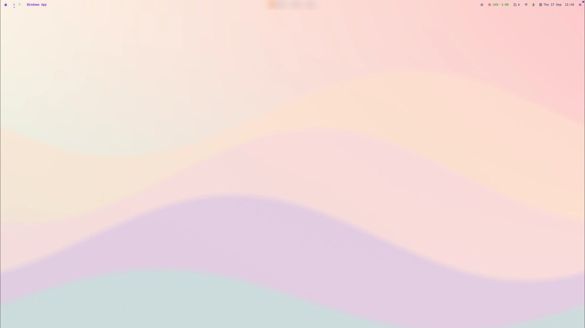
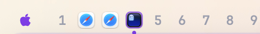
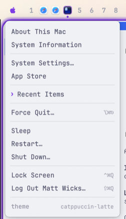
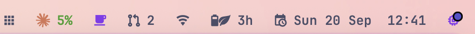
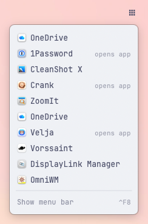
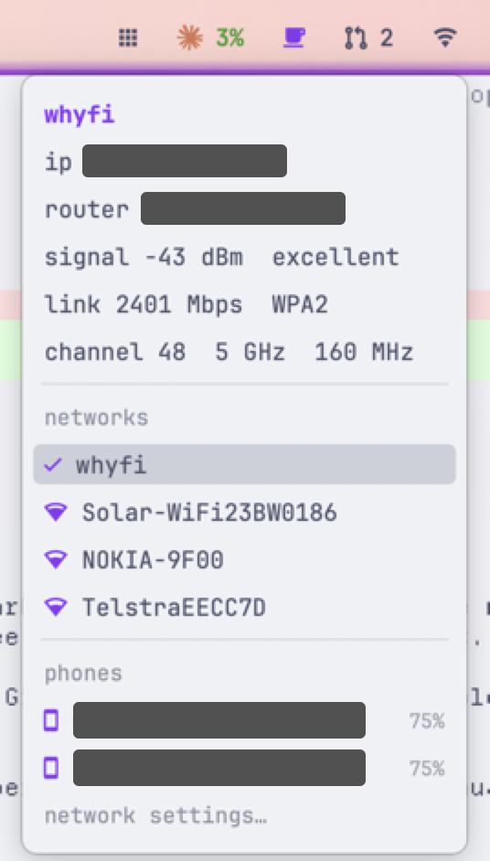
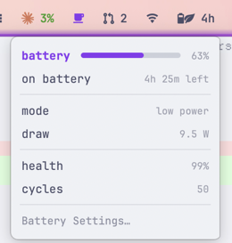
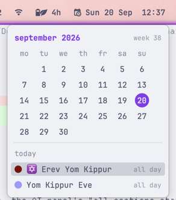
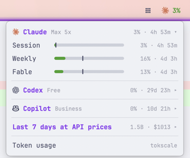
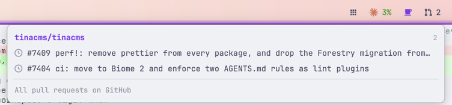

```text
   ░ ░ ░       ▄▄▄▄  ▄▄   ▄▄  ▄▄▄▄   ▄▄▄▄▄  ▄▄▄▄▄ ▄▄  ▄▄ ▄▄  ▄▄▄▄  ▄▄▄▄▄▄  ▄▄▄▄
 ▗▄▒▒▒▒▒▄▖    ██  ██ ██▀▄▀██ ██  ██ ██     ██     ██  ██ ██ ██  ██   ██   ██  ██
 ▐███████▌▜▖  ██  ██ ██ ▀ ██ ██▀▀██ ██     ██     ██▀▀██ ██ ██▀▀██   ██   ██  ██
  ▜█████▛▗▘   ▀█▄▄█▀ ██   ██ ██  ██ ▀█▄▄▄▄ ▀█▄▄▄▄ ██  ██ ██ ██  ██   ██   ▀█▄▄█▀
 ▀▀▀▀▀▀▀▀▀       omakase + macOS + macchiato
```

# Omacchiato

omakase + macOS + macchiato. An [omarchy](https://omarchy.org)-style tiling
desktop for macOS 26 and 27, built around the
[OmniWM](https://github.com/BarutSRB/OmniWM) window manager. One
`install.sh` gives you a Super key on Caps Lock, niri columns and
Hyprland's dwindle layout, a status bar that draws its pills, popups,
sliders and screen dimming from one process, trackpad swipes, a
workspace overview with live window previews, and a theme switch that
recolours the bar, the focus border, the terminal and the wallpaper in
one command.

Omacchiato is a fork of [omacosy](https://github.com/paulsp94/omacosy)
by Paul Spende, under the same MIT licence. On a Mac with omacosy
installed, `install.sh` moves that install to the new names. macOS then
asks again for the permissions of the bar and the gesture daemon.



Numbers from this repo, measured on the author's desk:

- The whole environment idles at about **293MB** across OmniWM, the
  bar, the overview, the gesture daemon and Karabiner's two user
  processes. Per-process figures are under [Memory use](#memory-use).
- A workspace switch repaints the bar in **2.5 ms**, because the bar
  holds the window model in memory and asks no one anything. The shell
  bar it replaced took 164 ms for the same event.
- The bar makes **one network call** by default, the weather fetch.
  Delete that pill and nothing leaves the machine. There is no
  telemetry and no background update check.
- Omacchiato's own binaries never run as root. Karabiner-Elements does,
  and [What it does not do](#what-it-does-not-do) says what that means.
- Five small binaries, Swift and C, built by the installer: the bar,
  the overview, the gesture daemon, a system helper and an IPC client
  for OmniWM that launches in about 3 ms.

> Built for macOS 26 (Tahoe) and in daily use on macOS 27, on one desk:
> a MacBook Pro plus two external displays. It uses display roles
> instead of hardware names and detects the notch per display, but so
> far it has run on this machine. The permission setup is real work.
> Issues and PRs are welcome; support promises are not made.

## Install

```sh
git clone https://github.com/wicksipedia/omacchiato.git ~/.local/share/omacchiato &&
cd ~/.local/share/omacchiato && ./install.sh
```

The clone location matters. Configs are symlinked into the repo, and
macOS privacy (TCC) blocks launchd services from reading `~/Documents`,
`~/Desktop` and `~/Downloads`. If you clone there anyway, the installer
copies the configs instead; edits then need an `install.sh` re-run.

`install.sh` is idempotent. It installs Homebrew if missing, runs
`brew bundle`, compiles the helper binaries, symlinks configs (backing
up anything it would replace), copies OmniWM's settings template once,
adds Karabiner rules for your app choices, hides the native menu bar,
applies the default theme (tokyo-night) and starts the services. It
also checks app versions against `config/requirements.conf`, starting
with OmniWM 0.7.0, and prints the `brew` command that fixes an app
that is too old.

[Permissions](#permissions) lists every grant it asks for, what each
one is used for, and what breaks without it. Karabiner-Elements also
asks you to approve its driver extension.

To update:

```sh
omacchiato-update          # pull, then re-run the installer
omacchiato-update --check  # only say whether there is anything new
```

`omacchiato-update` refuses a clone with local edits and a branch that
has diverged, and pulls the branch that yours tracks, so a clone of a
fork updates from the fork. Nothing contacts the network unless you
run it.

## What you get

### Tiling on OmniWM

OmniWM tiles the windows. Workspaces start in its niri layout, a row
of columns that scrolls sideways, and `Option+Shift+L` switches a
workspace to dwindle, where each new window splits the focused one
along its longer edge. That is the omarchy feel, and on a 3440-wide
display it is the difference between a usable third window and three
narrow strips. `omacchiato-spawn`, which the terminal chord runs,
preselects omarchy's insertion side (right of a wide window, below a
tall one) and serialises spawns, so a burst of `Super+Enter` becomes a
clean staircase instead of splitting the same cell again and again.

Nine workspaces in total, not a set per display: 1 to 5 on the main
display and 6 to 9 on the secondary one. `Super+N` reaches workspace N
from anywhere. Unplug a display and its workspaces move to the nearest
one; plug it back in and each window goes home, so anything you opened
while undocked stays put.

OmniWM draws the focus border, and each theme sets its colour, a
gradient and a glow.

### Super on Caps Lock

Karabiner remaps Caps Lock to `cmd+ctrl+alt`, a combination macOS
never uses, so omarchy's scheme works letter for letter without
breaking typing or app shortcuts. Caps Lock tapped alone is Escape.
OmniWM's hotkeys cannot run shell commands, so the chords that open
apps, switch themes, lock the screen and show the cheatsheet are
Karabiner rules that `install.sh` writes for you. The full map is
under [Keybindings](#keybindings), and `Super+K` draws it on screen
from the live config.

### The bar

One process draws all of it: the bar, its popups, the sliders and the
gamma shade are surfaces of `helper/bar.swift`. The bar is
transparent, and each item is a flat radius-4 pill. It subscribes to
the system's own publishers (SkyLight for window churn, CoreAudio for
volume, IOPS for battery, DisplayServices for brightness,
SCDynamicStore for the network, IOBluetooth for devices, Apple Music's
own broadcast for the track) and polls for nothing macOS announces;
its only timers are the weather fetch and the clock. OmniWM keeps a
42-point strip at the top of each display free for it, and fullscreen
windows keep out of the strip too.



Left to right:

- **Apple menu**: the real one, read over Accessibility. About This
  Mac, System Settings, Recent Items (with app and file-type icons
  resolved locally, because AX exposes none), Force Quit and the power
  verbs, plus Omacchiato's Next Theme at the bottom.
- **Workspaces**: one capsule per display, showing only that display's
  workspaces. A chip shows the icons of up to three apps on the
  workspace, fanned like a hand of cards, or the workspace's digit when
  it is empty. A dot marks the workspace on show, and on it the focused
  app wears a ring in the theme accent. Click a chip to jump.
- **App menus**: click the front app's name and its menu bar drops into
  a popup. File, Edit and the rest drill into their real items, nested
  submenus included, and clicking a leaf performs it over AX without a
  native menu appearing. Shortcuts sit right-aligned, and a menu taller
  than the screen scrolls.
- **Media**: album art with artist and track from Apple Music. A title
  too long for the pill scrolls, moved by Core Animation so the bar
  redraws nothing. It sits in the centre on a flat display, joins the
  left cluster on a notched one, and hides when Music is not running.
  Click the title to open Music.





- **Menu bar apps**: the grid pill lists the third-party apps that have
  an icon in the hidden macOS menu bar. Clicking a row gives that icon
  a real click: the pointer moves to the top edge so the menu bar
  slides in (about 0.25 s), the bar clicks the icon, and the pointer
  moves back. An icon that the notch hides has nowhere to click, so its
  row opens the app instead. `Show menu bar ⌃F8` reveals the menu bar
  with keyboard focus on its icons.
- **Plugin pills**: anything you add in `bar-plugins.conf`. The
  repo ships an AI usage pill, a GitHub pull requests pill, a
  keep-awake pill and an AirPods pill; see [Plugin pills](#plugin-pills).
- **Weather**: wttr.in, with a details popup.
- **Wi-fi**: the pill is the icon alone. The popup names the network
  and adds the IP and router, signal with a verdict, link rate and
  security generation, and the channel with its band and width.
- **Bluetooth**: a device menu (click to connect or disconnect) and a
  power toggle.
- **Brightness**: scroll adjusts, click opens a slider. Scrolling past
  zero keeps going: a shade dims the display below its hardware
  minimum by scaling gamma, so there is no overlay window and
  screenshots come out normal. It survives sleep and reaches external
  displays, which have no backlight API, and gamma resets when the
  process exits, so a crash restores the screen by itself.
- **Microphone**: a struck-through microphone while the default input
  is muted, nothing otherwise. It follows a CoreAudio property
  listener, so it changes the moment the microphone does.
- **Volume**: scroll adjusts, click opens a slider and the output
  device menu.
- **Battery**: charge and state, live draw in watts, the adapter's
  wattage, time to full or empty once the rate settles, and health as
  the ratio of full charge to design capacity, which keeps moving
  after Apple's own figure has rounded to 100%. A leaf or a
  speedometer joins the cell in low or high power mode, and a thermal
  row appears when the system reports anything above nominal.
- **Clock**: a calendar popup.
- **Activity**: btop in a floating terminal.

<table>
  <tr>
    <td valign="top"></td>
    <td valign="top"></td>
  </tr>
  <tr>
    <td valign="top"></td>
    <td valign="top"></td>
  </tr>
</table>

A popup stays open while the pointer is anywhere in the bar or the
popup, and closes when it is in neither. Click paths never touch the
network: each pill fetches on a timer into the model and renders from
that.

With no window manager running, the bar hides itself when a window
takes the whole display and comes back when you put the pointer on the
very top edge, so brightness and volume stay reachable mid-film.

### Plugin pills

`~/.config/omacchiato/bar-plugins.conf` adds pills without a rebuild. A
command prints a label, or a JSON object with a colour, an icon and
popup rows, and the bar draws the result. The format is under
[Adding pills](#adding-pills). Three plugins ship in `bin/`:

- **AI usage** (`omacchiato-ai-usage`): the plan usage of Claude, Codex
  or Copilot, from tokscale. By default the pill shows how much of
  Claude's five-hour window you used and the time until it resets. The
  popup shows each usage window of each provider you choose, the status
  of that provider's service with any open incident, and the last seven
  days: tokens per day and per model at API prices, sessions, active
  days and active hours.
- **GitHub pull requests** (`omacchiato-github-prs`): the pill counts your
  open PRs and adds `!` when one has an unread notification. The popup
  groups them by repository, marks each with what it needs next
  (📝 draft, 💥 CI failed or conflicts, 🏗️ CI running, 💬 feedback to
  resolve, ✅ ready to merge, ⏳ waiting for a review) and says what it
  waits for. A PR based on another PR in the list sits under it,
  indented and marked `↳`.
- **Keep awake** (`omacchiato-keep-awake`): a cup while something holds
  the Mac awake, nothing otherwise. It reads the power assertions
  rather than any app's saved setting, ignores the ones the system
  holds as a matter of course, and lists the holders and how long each
  has held on a click.
- **AirPods** (`omacchiato-airpods`): shows only while AirPods Pro or
  AirPods Max are connected, with the lowest battery level. The popup
  lists the battery of each earbud and the case, lists the noise
  control modes with a check on the current one, and links to Sound
  settings. Click a mode to switch to it.

<table>
  <tr>
    <td valign="top"></td>
    <td valign="top"></td>
  </tr>
</table>

### Workspace overview


A 4-finger swipe up, or `Super+O`, dims the wallpaper and gives every
non-empty workspace of the pointer's display a card with live window
previews (ScreenCaptureKit, composed into the tile layout), app icons
and an accent ring on the focused workspace. Click a card or press its
digit to jump; empty workspaces show as small chips, and digits work
for them too. Swipe down, press Escape or click the backdrop to
dismiss. It is a resident daemon, so it opens at once.

Type while it is open and a search pill filters the cards to matching
window titles and apps; `Enter` jumps to the first hit. Drag a card to
reorder the workspaces, or drop it on an empty chip to move the
workspace there.

### Gestures

OmniWM's own swipes do the horizontal work: a 4-finger swipe left or
right switches workspaces, and in a niri workspace a 3-finger swipe
scrolls the columns and focuses the column it stops on. A fast flick
can pass more than one column. `omacchiato-gesture` keeps the 4-finger
swipe up for the overview and swipe down to close it, reading raw
trackpad contacts because macOS 26 stopped carrying touch data in
normal events. `macos-defaults.sh` turns off the system's 4-finger
gestures and its 3-finger swipe between full-screen apps, so Mission
Control never fights them, and `uninstall.sh` restores them.

### Themes that follow macOS

`theme-set <name>` switches everything at once: the bar, OmniWM's
focus border (colour, gradient and glow), the wallpaper on every
display, Ghostty, herdr, and any terminal that follows omarchy's
`~/.config/omarchy/current/theme` convention. `Super+Shift+T` cycles
the themes and `Super+Shift+B` cycles the current theme's wallpapers.

Set a pair once and the desktop follows the macOS appearance:

```sh
theme-set light:catppuccin-latte,dark:catppuccin
```

The bar watches the system appearance and runs `theme-set` with the
pair again when it changes, so the bar, the border, the terminal and
the wallpaper switch together. Five themes ship, each with omarchy's
wallpaper set: `tokyo-night`, `catppuccin`, `catppuccin-latte`,
`gruvbox` and `osaka-jade`. Copy a directory under `themes/` to add
one.

### Parking the setup

`omacchiato-toggle off` returns to a vanilla Mac in one command (OmniWM
quits, and the gesture daemon and the bar stop) without uninstalling.
`omacchiato-toggle on` brings everything back, and no argument flips.
`./uninstall.sh` removes what the install manifest lists and restores
what it displaced; see [Back to a normal Mac](#back-to-a-normal-mac).

## Bundled tools and plugins

Everything the Brewfile installs, everything `install.sh` fetches, and
the code this repo absorbed, with what Omacchiato uses each for.

### Installed by the Brewfile

| Tool | Used for | Source |
|---|---|---|
| OmniWM | The window manager: niri and dwindle layouts, the focus border, the command palette, the quake terminal and the horizontal swipes | [BarutSRB/OmniWM](https://github.com/BarutSRB/OmniWM) |
| Karabiner-Elements | Caps Lock as Super, and the chords that run commands | [pqrs-org/Karabiner-Elements](https://github.com/pqrs-org/Karabiner-Elements) |
| Ghostty | The default terminal, with a hidden titlebar and colours from the theme. The activity pill opens btop in your terminal | [ghostty-org/ghostty](https://github.com/ghostty-org/ghostty) |
| Raycast | The launcher on `Cmd+Space`, a hotkey you set in Raycast itself | [raycast.com](https://www.raycast.com) |
| starship | The shell prompt, from `config/starship.toml` | [starship/starship](https://github.com/starship/starship) |
| fzf | Fuzzy finding in the shell, and the branch picker in `omacchiato-herdr-worktree` | [junegunn/fzf](https://github.com/junegunn/fzf) |
| eza | `ls`, `ll`, `la` and `lt` in `zsh/zshrc` | [eza-community/eza](https://github.com/eza-community/eza) |
| zoxide | Directory jumping in the shell | [ajeetdsouza/zoxide](https://github.com/ajeetdsouza/zoxide) |
| ripgrep | Search in the shell | [BurntSushi/ripgrep](https://github.com/BurntSushi/ripgrep) |
| bat | `cat` with highlighting in `zsh/zshrc` | [sharkdp/bat](https://github.com/sharkdp/bat) |
| lazygit | The `lg` alias | [jesseduffield/lazygit](https://github.com/jesseduffield/lazygit) |
| btop | The activity pill's floating monitor | [aristocratos/btop](https://github.com/aristocratos/btop) |
| jq | JSON handling in the GitHub pull requests pill | [jqlang/jq](https://github.com/jqlang/jq) |
| gh | The GitHub pull requests pill's API calls | [cli/cli](https://github.com/cli/cli) |
| JetBrains Mono Nerd Font | The bar's font, and the glyphs the pills and plugins use | [ryanoasis/nerd-fonts](https://github.com/ryanoasis/nerd-fonts) |

### Fetched or wired by install.sh

| Tool | Used for | Source |
|---|---|---|
| Homebrew | Installed if missing, then `brew bundle` | [Homebrew/brew](https://github.com/Homebrew/brew) |
| airpods-control | The AirPods pill's noise control modes. It ships source only, so `install.sh` builds the tagged release with the Command Line Tools, pinned by version and checksum. It uses a private Apple API; see [The AirPods pill](#the-airpods-pill) | [raulgg/airpods-control](https://github.com/raulgg/airpods-control) |
| tokscale | The AI usage pill: plan usage for each provider, and the last seven days of tokens, sessions and cost. Homebrew has no formula, so `install.sh` takes the macOS binary from the npm package, pinned by version and checksum | [junhoyeo/tokscale](https://github.com/junhoyeo/tokscale) |
| herdr | Optional. If herdr is installed, `install.sh` adds the keys in `config/herdr/keys.toml`, `theme-set` sets its theme, and `Ctrl+Alt+G` opens a worktree off a branch you pick | [herdrdev/herdr](https://github.com/herdrdev/herdr) |

### Plugins and scripts in this repo

| Script | What it does | Talks to |
|---|---|---|
| [`omacchiato-ai-usage`](bin/omacchiato-ai-usage) | The AI usage pill | tokscale, and the status page of each provider it shows |
| [`omacchiato-airpods`](bin/omacchiato-airpods) | The AirPods pill | `system_profiler`, `omacchiato-helper`, `airpods-control` |
| [`omacchiato-github-prs`](bin/omacchiato-github-prs) | The GitHub pull requests pill | `api.github.com` through `gh` |
| [`omacchiato-keep-awake`](bin/omacchiato-keep-awake) | The keep-awake pill | `pmset` |
| [`omacchiato-herdr-worktree`](bin/omacchiato-herdr-worktree) | herdr's `Ctrl+Alt+G` worktree picker | `git`, `herdr` |
| [`theme-set`](bin/theme-set), [`theme-next`](bin/theme-next), [`theme-bg-next`](bin/theme-bg-next) | Themes and wallpapers | Ghostty, OmniWM, herdr |
| [`omacchiato-ws`](bin/omacchiato-ws), [`omacchiato-ws-collapse`](bin/omacchiato-ws-collapse), [`omacchiato-spawn`](bin/omacchiato-spawn) | Workspace cycling, undocking, and spawning on the omarchy side | OmniWM over IPC |
| [`omacchiato-toggle`](bin/omacchiato-toggle), [`omacchiato-update`](bin/omacchiato-update), [`omacchiato-requirements`](bin/omacchiato-requirements) | Parking, updating and the version check | launchd, git, Homebrew |

### Absorbed and borrowed

| Project | What Omacchiato took | Source |
|---|---|---|
| omarchy | The idea, the 22-colour theme format, the palettes and the MIT-licensed wallpapers | [omacom/omarchy](https://github.com/omacom/omarchy) |
| aerospace-swipe | The gesture engine, which lives on as `omacchiato-gesture` (MIT, notice kept in `helper/gesture/`) | [acsandmann/aerospace-swipe](https://github.com/acsandmann/aerospace-swipe) |
| yyjson | The JSON parser inside `omacchiato-gesture` and `omacchiato-omni` (MIT) | [ibireme/yyjson](https://github.com/ibireme/yyjson) |
| wttr.in | The weather pill's one request | [chubin/wttr.in](https://github.com/chubin/wttr.in) |
| Catppuccin, Gruvbox, Tokyo Night | The palettes behind three of the themes, by way of omarchy's packs | [catppuccin/catppuccin](https://github.com/catppuccin/catppuccin), [morhetz/gruvbox](https://github.com/morhetz/gruvbox), [tokyo-night/tokyo-night-vscode-theme](https://github.com/tokyo-night/tokyo-night-vscode-theme) |

## Keybindings

Super is Caps Lock held. Karabiner sends it as `cmd+ctrl+alt`, and a
tap alone is Escape. Chords marked *Karabiner* come from
`bin/omacchiato-karabiner-omniwm`; the rest are OmniWM hotkeys from
`config/omniwm/settings.toml`. `Super+K` draws the same map on screen
from the live config, and you can type to filter it.

### Workspaces

| Chord | Action |
|---|---|
| `Super+1..9` | switch to workspace N, resolved on the display under the pointer (*Karabiner*) |
| `Super+Shift+1..9` | move the focused window to workspace N (*Karabiner*) |
| `Super+Tab` / `Super+Shift+Tab` | next / previous workspace of the display under the pointer (*Karabiner*) |
| `Super+B` | back and forth between the last two workspaces |
| `Super+O` | workspace overview (*Karabiner*) |
| `Super+Shift+O` | throw the focused window to the workspace on show on the next display (*Karabiner*) |
| `Super+Shift+Space` | throw every window of the workspace to the next display (*Karabiner*) |
| `Ctrl+Alt+Tab` / `Ctrl+Alt+Shift+Tab` | focus the next / previous display; the pointer moves with focus (*Karabiner*) |
| `Ctrl+Cmd+`` ` `` | focus the display you came from |
| `Ctrl+Alt+Shift+Page Up` / `Page Down` | move the column to the workspace up / down |

### Focus

| Chord | Action |
|---|---|
| `Super+Arrows` | focus the window in that direction |
| `Alt+Tab` | focus the previously focused window |
| `Ctrl+Alt+1..9` | focus column N |
| `Alt+Home` / `Alt+End` | focus the first / last column |

### Moving windows

| Chord | Action |
|---|---|
| `Super+Shift+Arrows` | swap with the neighbour under dwindle; move the column under niri |
| `Ctrl+Alt+Shift+Arrows` | stack the window into the neighbour as a group |
| `Ctrl+Alt+Home` / `Ctrl+Alt+End` | move the column to the first / last position |

### Layout and size

| Chord | Action |
|---|---|
| `Super+W` | close the window (*Karabiner* sends `Cmd+W`) |
| `Super+T` | toggle floating |
| `Super+S` | raise every floating window |
| `Super+F` | fullscreen inside the workspace; the bar strip stays |
| `Super+N` | native macOS fullscreen, a separate Space outside the workspace model |
| `Super+J` | toggle the split direction (dwindle) |
| `Alt+Shift+L` | switch the workspace between niri and dwindle |
| `Alt+T` | tabbed column on or off |
| `Super+`` ` `` / `Super+Shift+`` ` `` | show or hide scratchpad 1 / send the window to scratchpad 1 |
| `Super+-` / `Super+=` | narrower / wider: the column under niri, the split under dwindle (*Karabiner*) |
| `Super+Shift+-` / `Super+Shift+=` | shorter / taller, in either layout (*Karabiner*) |
| `Alt+,` / `Alt+.` | cycle the preset sizes backward / forward |
| `Alt+Shift+F` | toggle the column's full width |
| `Ctrl+Alt+F` | expand the column into the free space |
| `Ctrl+Alt+R` | reset the window's height in its column |
| `Alt+Shift+B` | balance sizes |

### Apps and system

| Chord | Action |
|---|---|
| `Super+Enter` | terminal, spawned on the omarchy side of the focused tile (*Karabiner*) |
| `Super+Shift+Enter` | browser (*Karabiner*) |
| `Super+Space` | OmniWM's command palette (*Karabiner*) |
| `Alt+`` ` `` | OmniWM's quake terminal, which reads the Ghostty config |
| `Ctrl+Alt+M` | the front app's menu bar as a menu at the pointer |
| `Super+Shift+F` / `+M` / `+G` | Finder / music / messenger, from `apps.conf` (*Karabiner*) |
| `Super+Shift+E` / `+C` / `+Y` | Outlook / Teams / a YouTube web app in `~/Applications` (*Karabiner*) |
| `Super+Shift+T` | next theme; one name, so a light/dark pair stops (*Karabiner*) |
| `Super+Shift+B` | next wallpaper of the current theme (*Karabiner*) |
| `Super+Shift+L` | lock the screen (*Karabiner*) |
| `Super+K` | keybinding cheatsheet (*Karabiner*) |
| `Cmd+Space` | Raycast, once you give it that hotkey in Raycast's settings |

Screenshots, clipboard and app switching stay macOS's own
(`Cmd+Shift+3/4/5`, `Cmd+C/V`, `Cmd+Tab`). `Alt+Tab` above works on
windows, which macOS's own switcher does not.

### Trackpad and mouse

| Gesture | Action |
|---|---|
| 4-finger swipe left / right | switch workspace (OmniWM) |
| 3-finger swipe left / right | scroll the niri columns; focus lands on the column it stops on (OmniWM) |
| 4-finger swipe up / down | open / close the overview (`omacchiato-gesture`) |
| Click a workspace chip | jump to it |
| Click a pill | open its popup; click a plugin pill without rows to re-run it |
| Scroll on the volume or brightness pill | adjust in 5% steps; brightness keeps going past zero into the shade |
| Click the activity pill | btop in a floating terminal |
| Click the media title | open Music |

### herdr

If herdr is installed and `~/.config/herdr/config.toml` has no
`[keys]` table, `install.sh` adds these. They need no `ctrl+b` prefix,
and the prefix keys still work.

| Chord | Action |
|---|---|
| `Ctrl+Alt+H/J/K/L` | focus the pane in that direction |
| `Ctrl+Alt+D` / `Ctrl+Alt+Shift+D` | split right / split down |
| `Ctrl+Alt+Z` | zoom the pane |
| `Ctrl+Alt+[` / `Ctrl+Alt+]` | previous / next tab |
| `Ctrl+Alt+T` / `Ctrl+Alt+W` | new tab / close tab |
| `Ctrl+Alt+Shift+T` | rename the tab |
| `Ctrl+Alt+Up` / `Ctrl+Alt+Down` | previous / next herdr workspace |
| `Ctrl+Alt+G` | new worktree off a branch you pick; herdr's own dialog branches off HEAD |

### On the modifier space

omarchy layers `Super+Ctrl` and `Super+Alt` on top of `Super`. This
setup cannot: Super is `cmd+ctrl+alt`, so those modifiers are spent
and Shift is the only layer left, two against omarchy's four. Bindings
that would collide moved by mnemonic (lock is `Super+Shift+L`, not
`Super+Ctrl+L`), and the overflow lives on Option chords, such as
`Option+Shift+L` for the layout toggle.

## Permissions

A window manager needs broad permissions, so here is the whole list:
every grant, which binary asks, what it is used for, and what you lose
by refusing it. Everything is refusable; the parts that depend on a
grant hide themselves rather than half-work.

`omacchiato-permissions` checks the grants of `omacchiato-bar` and
`omacchiato-gesture`. For each one that is off, it opens the page in
System Settings, waits for you to switch it on, and checks again.
`install.sh` runs it at the end. It does not check the grants of
Karabiner-Elements or OmniWM.

macOS gives a grant to the app that starts a program, not to the program
itself. So a swipe opens the overview with the gesture daemon's Screen
Recording grant, and `Super+O` opens it with Karabiner's.

| Grant | Who asks | What it does | Without it |
|---|---|---|---|
| **Accessibility** | OmniWM, `omacchiato-gesture`, `omacchiato-bar` (reads the focused app's menus for the app-pill popup, and reads and clicks other apps' menu bar icons for the menu bar apps pill) | Move, resize and focus other apps' windows. This is the tiling itself, and it is the broadest permission here. | Nothing tiles. Not optional in practice. |
| **Input Monitoring** | Karabiner-Elements and OmniWM; `omacchiato-gesture` on macOS 26 | Karabiner reads keys to remap Caps Lock; `omacchiato-gesture` reads raw trackpad contacts, because macOS 26 stopped carrying touch data in normal events. On macOS 27 it reads them without this grant. | No Super key, no swipe gestures. |
| **Screen Recording** | `omacchiato-gesture` for a swipe, Karabiner-Elements for `Super+O`; OmniWM (optional) | Captures a thumbnail per window for the overview cards, including windows the window manager has stashed offscreen. OmniWM uses it for its own overview thumbnails, the image of a window you drag, and Hidden Bar icons. | Cards fall back to app icons and titles. OmniWM starts without it. |
| **Bluetooth** | `omacchiato-bar` | Reads adapter power and the paired-device list for the bluetooth pill and its menu. A plugin pill runs as a child of the bar, so it reads Bluetooth with this grant: the AirPods pill needs it. | The bluetooth pill hides itself, and the AirPods pill shows no battery. |
| **Location** | `omacchiato-bar` | Reads **only** the wi-fi network's name, which macOS classes as location data. No coordinate is requested; the authorisation itself is what unlocks `CWInterface.ssid()`. | The wi-fi popup's title row reads "wi-fi" instead of your network's name. |
| **Automation** | `omacchiato-bar`, `theme-set`, and the terminal that runs `install.sh` | Apple Events to **Music** (the current track and its artwork), to **Ghostty** (reloading its colours after a theme change) and to **System Events** (sleep, lock and restart from the Apple menu; setting the wallpaper; adding OmniWM as a login item). | The media pill has no artwork; those menu rows do nothing; OmniWM does not start at login until you add it under System Settings > General > Login Items. |
| **Files and Folders** | `omacchiato-bar` | Only if your clone lives in `~/Documents`, `~/Desktop` or `~/Downloads`. The bar reads its palette from the theme directory inside the repo, and macOS walls launchd agents off from those folders. | The bar **hangs at startup** waiting on the prompt. Clone to `~/.local/share/omacchiato` and this never comes up. |
| **Keychain** | tokscale, when the AI usage pill shows Claude | Reads the Claude Code sign-in token from your login keychain with `security`, to ask Anthropic for your usage. It never writes to the keychain and never refreshes the token. | The Claude section has no usage windows. |
| **Allow in the Background** | `install.sh` (launch agents for the bar and the gesture daemon) | macOS lists the agents under System Settings > General > Login Items & Extensions. They start at login and restart if they quit. | The parts whose switch is off do not run. |

On **Location**: it buys one string. The bar requests authorisation and
then reads `ssid()`. It never asks for a position, holds no coordinate
and starts no location updates. Measured on macOS 26.3, an unbundled
binary reads `nil` however it is authorised, which is why the bar
ships inside a minimal `.app`.

Grants are tied to a binary's code signature. With an Apple
Development identity present, `install.sh` signs every helper with a
stable identifier so rebuilds keep their grants; without one, macOS
treats each rebuild as a new app and you re-grant after every install.

### What it does not do

- **No telemetry, no analytics, no crash reporting.** Nothing is sent
  anywhere about you or this machine.
- **One network call by default**: `https://wttr.in/?format=j1` on a
  long timer, for the weather pill. wttr.in infers your city from the
  IP the request arrives on; the bar sends no coordinates and holds no
  location API. Delete the weather pill and nothing leaves the
  machine. The plugin pills contact more hosts: the AI usage pill
  calls each provider's usage API through tokscale and each provider's
  status page, and the GitHub pill calls `api.github.com` through `gh`.
- **Omacchiato's own binaries never run as root.** `install.sh` uses no
  sudo, installs no LaunchDaemon, and every helper it builds runs as
  you, in your login session.
- **Karabiner-Elements does run as root, and you should know that
  before installing.** It is a Homebrew dependency here to turn Caps
  Lock into Super. It ships a DriverKit system extension plus daemons
  that run as root (`Karabiner-VirtualHIDDevice-Daemon`,
  `Karabiner-Core-Service`); that is what the driver-extension approval
  during install is. It is the most privileged thing this repo puts on
  your Mac, and it is third-party. Skip it if that trade is wrong for
  you; you lose the Super key and keep everything else.
- **Nothing here reads your keystrokes.** No Omacchiato binary opens a
  keyboard event tap. Only Karabiner sees keys, which is inherent to
  remapping one. `omacchiato-gesture`'s event tap is gesture-only and
  listen-only (`1 << NSEventTypeGesture`,
  `kCGEventTapOptionListenOnly`), so it cannot see or alter a
  keystroke. Debug logs (`/tmp/omacchiato-*.log`) carry window titles,
  app names and workspace numbers, never input. The menu bar apps pill
  posts mouse clicks and one key chord (Ctrl+F8), and reads no keys.

## App choices and shell

Keybindings launch apps defined in `config/apps.conf`. The defaults
are Ghostty, Safari, Spotify and Slack (terminal, browser, music,
messenger). Override any of them in `config/apps.local.conf`
(gitignored), then re-run `install.sh`:

```sh
# config/apps.local.conf: your picks win over apps.conf
TERMINAL=WezTerm
BROWSER=Arc
```

The music app only sets what `Super+Shift+M` opens. The media pill
reads Apple Music whichever app you pick.

Your personal shell config belongs in `~/.zshrc.local`; the repo's
`zshrc` wires the CLI stack and sources it. Put an alias or setting
that must override the CLI stack in `~/.zshrc.after`, which `zshrc`
sources last.

## Configuring the bar

### Choosing pills

`~/.config/omacchiato/bar-pills.conf` sets what each right-cluster pill
does, one `<name> = <mode>` per line. The names are `menubar`,
`weather`, `wifi`, `bluetooth`, `brightness`, `volume`, `mic`,
`battery`, `clock` and `activity`. The modes are `hide` and `icon`.
`volume` also takes `muted`, and `battery` takes `time`. Lines starting
with `#` are comments.

```
weather = hide
battery = icon
```

`hide` also skips the pill's provider, so hiding `weather` stops the
wttr.in fetches and hiding `bluetooth` never touches the Bluetooth
grant. `icon` drops the label and keeps the glyph; the weather pill
ignores it, because its glyph is part of the label. `volume = muted`
draws the volume pill only while the output device is muted or at
zero, as a red icon, the same way the microphone pill works.
`battery = time` shows only the battery icon on AC power; on battery
it adds the time left, in whole hours or in minutes under an hour.

`media = <characters>` sets how much of the track title the music pill
shows before the title scrolls. The default is 28. A display with a
notch uses five sevenths of the number, so 20 by default.

The bar reads the file once at startup, so restart it to apply an
edit:

```sh
launchctl kickstart -k "gui/$(id -u)/com.omacchiato.bar"
```

`omacchiato-popup <item> [display]` opens a pill's popup from a script or
a Karabiner chord, as a click on the pill does. The item is a pill
name, a plugin pill's name, `apple` or `appmenu`, and the display is
its name as macOS shows it, such as `"DELL U2722D (1)"`. Without a
display it uses the display under the pointer, and with no item it
closes the open popup.

### Adding pills

`~/.config/omacchiato/bar-plugins.conf` adds pills without a rebuild.
Each `[name]` section takes a `command`, run by `/bin/sh -c`, whose
first line of stdout becomes the label. `interval` is the gap between
runs in seconds (minimum 1, default 30) and `icon` is an optional
glyph. The icon takes the pill's colour unless `icon_color` names one:
a theme colour such as `accent`, or `#RRGGBB` for a brand colour.

```
[cpu]
command = ps -A -o %cpu | awk '{s+=$1} END {printf "%.0f%%", s/8}'
interval = 5
```

Plugin pills sit at the left of the right cluster, in file order.
Clicking one runs its command again at once. A name that matches a
built-in pill is ignored, and so is a section with no `command`.
Labels are cut at 32 characters, because the cluster is laid out from
the right edge inwards and a long one would push the other pills off
screen.

The command is passed to `sh` as an argument, never spliced into a
shell string. It runs with `~/.local/bin` and the Homebrew prefixes
ahead of `PATH`, so a plugin can name a script or a `brew` binary
directly, and it runs with the bar's own permission grants. Like the
rest of this file it is read once at startup.

A command that prints a JSON object instead of a line can also set the
pill's colour and give it a popup:

```json
{
  "label": "10% - 2h 6m",
  "color": "green",
  "rows": [
    {"text": "Claude", "hero": true},
    {"separator": true},
    {"text": "Session", "detail": "10%"},
    {"text": "5-hour window", "slider": 0.1, "marker": 0.58},
    {"text": "Resets in 2h 6m", "dim": true}
  ]
}
```

`color` is one of `accent`, `label`, `muted`, `red`, `green` or
`yellow`, resolved from the current theme, and tints both the icon and
the label. A row takes the same `color` names. A row with an `https`
or `x-apple.systempreferences:` `url` opens it when clicked, and a row
with a `terminal` command opens your terminal on that command instead,
the way the activity pill opens btop. A row with a `run` command runs
it with no window, then runs the plugin again, so the popup shows what
the command changed. Both run with the same trust as the plugin
command that printed them. A colour emoji draws its own colours and
ignores the icon tint, which is why the label carries it too. `icon`
overrides the config.
A row's `icon` draws a glyph before its text, in the accent colour or
in the row's `icon_color`, which takes a theme colour name or
`#RRGGBB`.

A row with `"section": "closed"` or `"section": "open"` is a header.
A click on it shows or hides the rows after it, up to the next header
or a row with `"section": "end"`. The value sets how the section starts,
and the bar keeps each click until it restarts. The header shows ▸ when
the section is closed and ▾ when it is open.

`parts` adds more icons to the pill, each in its own colour, after the
icon and label:

```json
{"label": "", "color": "green", "parts": [
  {"icon": "\uec82", "icon_color": "#D97757", "label": "27%"},
  {"icon": "\uec81", "icon_color": "label", "label": "0%"}
]}
```

Each part's label takes the pill's `color`.

A `slider` between 0 and 1 draws a progress track. On a slider row
`text` is a short right-aligned readout rather than a label, so put
the label on the row above, and `color` sets the fill. A `marker`
between 0 and 1 draws a tick across the track; the AI usage pill uses it
to show how far through each usage window you are. A `bar` between 0
and 1 draws the same track inside an ordinary row, between its `text`
and its `detail`, and all such bars in a popup share one column. Give
a pill rows and clicking it opens the popup instead of re-running the
command.

A pill draws nothing while its label and its icon are both empty,
which is how a pill reports a state worth no space at all. Send
`"icon": ""` to hide one, because an absent `icon` falls back to the
glyph the config names.

### The AI usage pill

`omacchiato-ai-usage` shows the plan usage of Claude, Codex and Copilot.
[tokscale](https://github.com/junhoyeo/tokscale) reads the numbers, and
`install.sh` installs it. Two settings on the command line choose the
providers:

- `--pill` sets the providers in the pill label, and the usage window
  for each one: `<id>[:<window>]`, separated by commas. The default is
  `claude`.
- `--panel` sets the providers in the popup, separated by commas. The
  default is the `--pill` providers.

An id is `claude`, `codex` or `copilot`. A window is the name that the
popup shows for it, such as `weekly` or `fable`, and case does not
matter. Without a window, the pill uses the five-hour window. `5h`
names it for every provider, and `max` takes the window with the most
use. If a provider has no window of that name, the pill uses `max`.

```ini
[ai]
command = omacchiato-ai-usage --pill claude,codex:weekly --panel claude,codex,copilot
interval = 120
icon = 
icon_color = #D97757
```

With one provider, the label shows the percent used and the time until
that window resets, such as `23% · 2:25`. With more, it shows each
provider's logo in its brand colour and its percent, in `--pill` order.
The `icon` setting then does not show, because one icon cannot name
more than one provider. The Claude logo is `#D97757`. The OpenAI and
Copilot logos are black or white, so they take the theme's label
colour. The percents are green under 50%, yellow under 80% and red
above.

The popup has one section for each `--panel` provider, and all sections
start closed. Click a header to open its section. If tokscale reports
more than one Codex account, each account gets a section. The header
shows the provider's logo, its name and the plan. The section shows the service status and each usage window. Each
window has a bar with a tick at the share of the window that has
passed, and its colour compares the two: green at or near an even
pace, yellow more than 5 points ahead, and red more than 20 points
ahead or at 90% used.

The status row reads the provider's components on its status page:
Claude Code on status.claude.com, the Codex components on
status.openai.com, and Copilot on githubstatus.com. It ignores the
page's overall rating, which also drops when another product of that
company has a problem. If the worst component is not operational, the
pill gets 🏥 for a minor problem or 🪦 for a major one. An open
incident adds rows with its title, its state and the time of its latest
update, and a click opens the incident page. status.openai.com lists no
incidents, so Codex has the status row only.

After the providers, a closed section holds the last seven days from
tokscale's read of the session logs on this Mac: tokens per day and per
model with their value at API prices, sessions, active days and active
hours. The last row opens tokscale's full report in a terminal.

The script runs `tokscale usage` at most every five minutes and reads
the week every ten minutes. If a provider is missing from one run, the
popup keeps its last numbers for 15 more minutes. tokscale reads the
Claude Code token and never refreshes it or writes it back: a third
party that rewrites the CLI's own credentials can race Claude Code and
sign you out. For the icon, the Nerd Font Claude glyph is U+EC82.

### The AirPods pill

`omacchiato-airpods` shows a pill while AirPods Pro or AirPods Max are
connected, and prints no pill otherwise. Add it to `bar-plugins.conf`:

```ini
[airpods]
command = omacchiato-airpods
interval = 10
```

With `interval = 10`, the pill shows up to 10 seconds after the AirPods
connect. The label is the lowest battery level of the earbuds, or of
the AirPods Max, and turns red at 20% or less. The case does not count.

The popup shows a battery bar for each earbud and the case, or one for
AirPods Max. Below it, one row for each noise control mode that the
device supports: Off, Transparency, Adaptive and Noise Cancellation.
The current mode has a check, and a click switches to that mode. The
last row opens Sound settings. With two devices connected, each device
is a section that starts closed.

Nothing on the Mac reports whether AirPods charge. A cable to this Mac
is the closest fact, so the script marks the battery row with 🔌 while
`ioreg` lists the AirPods as a USB device with the same serial number.
A wall charger stays invisible. While the cable carries the audio, the
noise control rows drop out: airpods-control controls a device only
over Bluetooth.

AirPods Max report no battery to `system_profiler`, so the script also
runs `omacchiato-helper bt battery`, which reads the percentages that
IOBluetooth carries. A value from `system_profiler` wins where both
report one.

You can rename AirPods, so the script finds the model from the
device's Bluetooth product ID. macOS ships the product ID of each Apple
model in `CoreTypes.bundle`, and the script counts any model whose type
starts with `com.apple.airpods-pro` or `com.apple.airpods-max`. A new
model works after the macOS update that adds it. The script holds the
IDs of the two models that are older than that list: AirPods Pro and
AirPods Max (Lightning). It reads the battery from
`system_profiler SPBluetoothDataType -json`, which comes with macOS.

The noise control rows come from
[airpods-control](https://github.com/raulgg/airpods-control), which
`install.sh` builds from source at a pinned version. macOS gives the
noise control mode only to a process with a private Apple entitlement.
airpods-control loads a small library into its own process that answers
yes to that one check, and to no other. Its `SECURITY.md` describes the
library. It is a new project, and a macOS update can break it. Without
it, or when it fails, the popup shows the battery rows only.

### The GitHub pull requests pill

`omacchiato-github-prs` lists the open pull requests you authored. It
needs the GitHub CLI, signed in with `gh auth login`.

```
[github]
command = omacchiato-github-prs -repo:owner/bots
interval = 120
```

Arguments are extra GitHub search qualifiers. `-repo:owner/name`
leaves out a repository of automated PRs, and `org:name` keeps one
organisation. For the icon, the Nerd Font pull request glyph is
U+F407.

Each PR gets one mark, for what it needs next. If more than one
applies, the first in this list wins:

- 📝 a draft
- 💥 CI failed, or the branch has merge conflicts
- 🏗️ CI is running
- 💬 feedback to resolve: changes requested, or a review thread from
  someone else that nobody has resolved
- ✅ ready to merge: approved, with passing checks and no conflicts
- ⏳ waiting for a review

The pill turns red while CI fails on any open PR. Clicking a PR row or
the line under it opens the PR. To drop a PR from the list,
unsubscribe from its notifications on GitHub.

An update is an unread GitHub notification on the PR. GitHub marks the
notification read when you open the PR, so the `!` goes at the next
run after you look. A PR merged (🟣) or closed (⚫) in the last week
stays in the list while its notification is unread. To find those
notifications the script reads every page of your unread inbox, about
half a second per 50, while the search runs. If GitHub is out of
reach, the popup keeps the last list and says when it was fetched.

### The keep-awake pill

`omacchiato-keep-awake` shows a cup while something is keeping the Mac
awake, and hides otherwise. It names no particular app: it reads the
power assertions, and ignores the ones held from the system's own
directories, because powerd, coreaudiod and sharingd hold one as a
matter of course. It also ignores an assertion held by a coding agent,
which is a short lease on the machine rather than a setting you left
on. Reading the assertion rather than an app's saved setting means it
still reports the truth after the app holding it quits. Clicking it
lists what is holding the Mac awake and how long each has held it.

The microphone pill is built in rather than a plugin, because
CoreAudio costs about 65 ms to open in a fresh process and the bar
already holds it open for the volume pill.

### Workspace icons

The optional `~/.config/omacchiato/workspace-icons.conf` file sets an
icon per workspace. Each non-comment line has one workspace name, an
equals sign, and either one Unicode scalar or a reverse-DNS bundle
identifier.

```
1 = ★
14 = ◆

4 = com.apple.Safari
```

The bar first uses a configured icon. It then shows the icons of up to
three apps on that workspace, fanned like a hand of cards, with the
app in the leftmost window in front. Otherwise it shows the
workspace's last digit. Exact workspace names win: in this example,
workspace `14` uses `◆`, not the `4` shorthand. The shorthand applies
only to multi-digit, all-numeric workspace names ending in `1` through
`9` when they have no exact declaration.

The bar reads the file once at startup, so restart it to apply an
edit. Malformed lines are logged and ignored. A well-formed bundle
identifier that does not resolve to an installed app blocks the
shorthand for that exact workspace, and the bar falls back to the app
icons or the digit. Image paths are unsupported because the bar
resolves configured app icons at startup and does no file I/O while it
draws.

### The native menu bar

The native menu bar auto-hides and the bar sits in its place. If a
fullscreen window covers the bar and no window manager runs, the top
edge brings the bar back; otherwise the top edge belongs to the
auto-hidden native menu bar, which reveals above the bar and stays
clickable. If the native menu bar gets stuck revealed over the bar (a
Tahoe bug, most often poked by a Focus mode's menu-bar icon),
`killall SystemUIServer` resets it.

## Themes

Each `themes/<name>/` holds `colors.toml` (omarchy's 22-colour
palette), `sketchybar.sh` and `borders.sh` (bar and focus-border
colours; the files keep their omarchy names and format), and
`backgrounds/` (wallpapers from omarchy's MIT-licensed theme packs;
catppuccin-latte's is drawn for this repo). Palettes compatible with
omarchy's scheme drop straight in.

`theme-bg-next <path>` sets any image you like as the wallpaper.
Switching themes restarts at the theme's first wallpaper.

OmniWM's focus border comes from `borders.sh`. `ACTIVE_COLOR` is the
border colour, an optional `GRADIENT_COLOR` turns the border into a
gradient from `ACTIVE_COLOR` to that colour, and `GLOW=1` adds
OmniWM's glow in the border's colours. With a light/dark pair,
`theme-set` also writes the dark theme's colours as OmniWM's dark-mode
border colours, so the border changes with the macOS appearance at
once. The theme owns the colours and turns the gradient and glow on or
off; OmniWM's border on/off and width, the glow's radius and opacity,
and the gradient's direction stay yours, so set those in OmniWM's
Settings.

Every colour in `sketchybar.sh` is `0xAARRGGBB`, so the leading byte
sets opacity. `ITEM_BG` fills the pills on the bar and `ROW_BG` fills
a highlighted row or a slider track inside a popup. They are separate
because a pill that reads well at half opacity over a wallpaper is too
faint for a track inside a solid popup. A theme that names only
`ITEM_BG` gets it for both.

`theme-set` also writes `[appearance] mode` in OmniWM's
`settings.toml` from the luminance of the theme's `background` colour,
so a light theme gets light chrome without extra configuration.

`theme-set` writes `~/.config/omacchiato/ghostty-theme` from the palette
and asks Ghostty to reload. The Ghostty config includes that file, so
the terminal follows the desktop theme. Do not set `theme` in
`~/Library/Application Support/com.mitchellh.ghostty/config`: macOS
config files load after the XDG one, so it would win. The reload goes
through `omacchiato-helper ghostty-reload`, not `SIGUSR2`, which Ghostty
accepts and ignores on macOS. The helper aims one Apple Event at each
Ghostty process, because Omacchiato opens an instance per window and
AppleScript addresses an app by bundle. OmniWM's quake terminal reads
the same Ghostty config files but is not a Ghostty process; it
re-reads them when OmniWM reloads `settings.toml`, which `theme-set`
edits for the focus border, so `theme-set` writes the Ghostty file
first.

herdr follows too. `theme-set` writes `[theme] name` in
`~/.config/herdr/config.toml` and runs `herdr server reload-config`.
An unknown name comes back as a reload diagnostic, and `theme-set`
then falls back to herdr's `terminal` theme, which takes the host
palette.

Raycast keeps its own themes and a script cannot set one, but Raycast
follows the macOS appearance, so it can track a light/dark pair by
itself. Import the Catppuccin Latte and Catppuccin Mocha themes once
from [themes.ray.so](https://themes.ray.so), then choose them as the
Light and Dark theme under Settings > General > Appearance. Themes
need Raycast Pro.

### Light and dark

`theme-set` takes a light/dark pair in the same syntax as Ghostty's
`theme` key:

```
theme-set light:catppuccin-latte,dark:catppuccin
```

`theme-set` stores the pair in `~/.config/omacchiato/theme.conf` and
applies the half that matches the current appearance. The bar watches
the system appearance and runs `theme-set` with the pair again when it
changes, and once when it starts. A pair sets OmniWM's
`[appearance] mode` to `automatic`, so OmniWM's own chrome follows the
system directly.

`theme-set` with one name stores that name instead, and so does
`Super+Shift+T`, which runs `theme-next`. Either one stops the
following until you set a pair again. On the first switch, macOS asks
whether omacchiato-bar can control Ghostty; refuse and the terminal keeps
its old colours.

## Tiling details

OmniWM's dwindle puts the new window on a different side from
omarchy's. With `smartSplit` off, a new window goes right in a
horizontal split and above in a vertical one, while Hyprland's
`force_split=2` puts it right or below. So `omacchiato-spawn` applies
OmniWM's own orientation rule (height times `splitWidthMultiplier`
greater than width means a vertical split) to the focused tile and
preselects down or right for each new window.

Floats sink behind tiles, because macOS orders windows per app, not
per window: a float sinks behind whichever app you focus next, and
pinning it would need a private call with SIP off. `Super+S` raises
every floating window.

The resize chords work in both layouts: each one tries the niri
command first, and that command fails on a dwindle workspace, so the
dwindle one runs instead. Keyboard focus also moves the pointer
(`moveMouseToFocusedWindow`), because `Super+Tab` and the throws act
on the display under the pointer.

Focus follows clicks and keys, because `followsMouse` is off in
`config/omniwm/settings.toml`. The finger counts for the swipes are in
its `[gestures]` table. An existing `~/.config/omniwm/settings.toml`
keeps its own values, so set `fingerCount = 3` and
`workspaceSwipeFingerCount = 4` there to match.

## OmniWM notes

[OmniWM](https://github.com/BarutSRB/OmniWM) is a signed and notarized
tiling window manager with niri and dwindle layouts. `install.sh`
installs it with Homebrew, starts it, and adds it as a login item.
OmniWM does not start while another window manager runs, so quit any
other one first.

The bar and the overview read OmniWM's workspaces over IPC, and
`theme-set` colours its focus border and sets its light or dark
chrome. `Super+N` and `Super+Shift+N` route through Karabiner into
`omacchiato-omni`, a held-socket IPC client written in C, so slots
resolve on the display under your pointer; OmniWM's native hotkeys are
name-global and would always hit the main set. The cost is a shell
command per chord, and the IPC round trip itself takes about 4 ms.

The template in `config/omniwm/settings.toml` puts workspaces 1 to 5
on the main display and 6 to 9 on the secondary one. `install.sh`
copies it to `~/.config/omniwm/settings.toml` once, and OmniWM and
`theme-set` edit that local copy, so settings for one desk stay out of
the repo. To pin workspaces to one display, set
`type = "specificDisplay"` and add the display's `displayUUID` and
`name` in the local copy. If a pinned display is missing, OmniWM
moves its workspaces to the nearest display.

With one display left, the bar also runs `omacchiato-ws-collapse`,
which moves the windows on any two-digit workspace into the lowest
free 1 to 9 slot and records where each came from. Plug the display
back in and each window goes home.

OmniWM is daily-driven on a docked multi-monitor desk, and
`docs/omniwm-port.md` carries a ledger of upstream quirks found while
porting. Read it before assuming a strange layout is Omacchiato's fault.

## Memory use

About **293MB** of physical footprint (what Activity Monitor calls
Memory) across OmniWM, the bar, the overview daemon, the gesture
daemon and Karabiner's two user processes. The measurement, on
2026-09-14 under OmniWM and docked to two external displays, came to
306MB; that figure included 13MB for the borders daemon, which
Omacchiato no longer runs. Footprint is the number to compare: resident set size
counts each process's share of the shared system frameworks more than
once. Karabiner's three root processes need root to measure, so they
are not in the total; their resident size is about 39MB. Largest
first:

| | footprint |
|---|---|
| OmniWM | 169MB |
| Karabiner (2 user processes) | 47MB |
| `omacchiato-bar` | 42MB |
| `omacchiato-overview` | 24MB |
| `omacchiato-gesture` | 11MB |

The figures move with uptime. `omacchiato-overview` caches a
half-resolution capture per window shown, so it starts near 9MB and
settles between about 25MB and 37MB. It plateaus there because it
filters the cache to the visible set on each open. Packaging the bar
as an `.app`, which is what unlocks the wi-fi network name, cost about
1MB.

## Back to a normal Mac

```sh
./uninstall.sh
```

Manifest-driven: `install.sh` records what this machine gained
(Homebrew packages that were not already present, every `defaults`
key's prior value, displaced symlinks and the wallpaper), and
`uninstall.sh` removes and restores exactly that. Tools and settings
you had before Omacchiato are never touched. Pre-manifest installs fall
back to a conservative teardown that leaves all Homebrew packages in
place.

## License and credits

MIT (see `LICENSE`). Standing on [omarchy](https://omarchy.org) (the
whole idea, plus MIT-licensed theme palettes and wallpapers),
[OmniWM](https://github.com/BarutSRB/OmniWM),
[Karabiner-Elements](https://karabiner-elements.pqrs.org) and
[aerospace-swipe](https://github.com/acsandmann/aerospace-swipe)
(MIT; its gesture engine lives on here as `omacchiato-gesture`, notice
kept in `helper/gesture/`). The full list, with what each is used for,
is under [Bundled tools and plugins](#bundled-tools-and-plugins).
